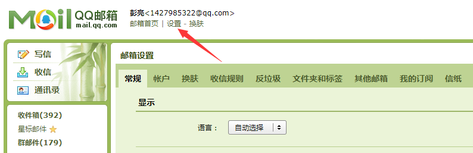
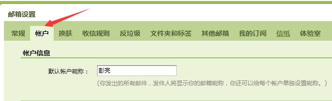
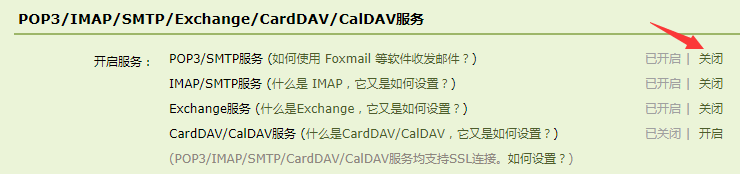
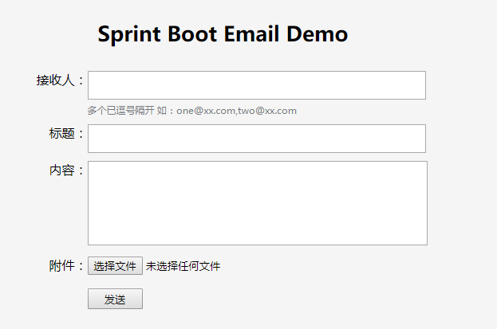

# 使用Spring Boot发送邮件

这里使用的是qq邮箱进行作为邮箱服务器

### 使用QQ邮箱准备工作

1.进入qq邮箱进入邮箱设置



2.点击账户选项卡



3.找到POP3/IMAP/SMTP/Exchange/CardDAV/CalDAV服务 开启 POP3/SMTP服务




https://service.mail.qq.com/cgi-bin/help?subtype=1&&id=28&&no=1001256

### 开始发送邮件

启动项目访问：http://localhost:8080 查看当前的小demo



**1、添加依赖**

```xml
<dependency>
    <groupId>org.springframework.boot</groupId>
    <artifactId>spring-boot-starter-mail</artifactId>
</dependency>
```

**2、添加配置参数**
```yaml
spring:
  mail:
    host: smtp.qq.com #邮箱服务地址
    username: xxxx@qq.com #发送人
    password: wrbsddwshxwf #qq邮箱密码是发送方的授权码
    properties:
      # 启动SSL时的配置
      mail.smtp.socketFactory.class: javax.net.ssl.SSLSocketFactory
      mail.smtp.socketFactory.fallback: false
      mail.smtp.socketFactory.port: 465
```
**3、开始编码**

* 发送一个简单的文本邮件

```java
@Test
public void sendSimpleEmailTest() {
    SimpleMailMessage msg = new SimpleMailMessage();
    //发送人
    msg.setFrom("1427985322@qq.com");
    //收件人
    msg.setTo("2874267468@qq.com");
    //主题
    msg.setSubject("测试邮件发送,sendSimpleEmailTest");
    //主题内容
    msg.setText("https://pengliangs.github.io");
    javaMailSender.send(msg);
}
```
* 发送一个带有html格式邮件

```java
@Test
public void sendHtmlEmailTest() throws MessagingException {
    MimeMessage message = javaMailSender.createMimeMessage();
    MimeMessageHelper helper = new MimeMessageHelper(message, true);
    helper.setFrom("1427985322@qq.com");
    helper.setTo("2440329859@qq.com");
    helper.setSubject("测试邮件发送,sendHtmlEmailTest");
    helper.setText("<div style='width:500px;height:500px;text-align: center;'>" +
            "<h1>我的个人博客</h1>" +
            "<p>https://pengliangs.github.io</p>" +
            "</div>", true);
    javaMailSender.send(message);
}
```

* 发送一个带有附件邮件

```java
@Test
public void sendAnnexEmailTest() throws MessagingException {
    MimeMessage message = javaMailSender.createMimeMessage();
    MimeMessageHelper helper = new MimeMessageHelper(message, true);
    helper.setFrom("1427985322@qq.com");
    helper.setTo("2440329859@qq.com");
    helper.setSubject("测试带附件的邮件");
    helper.setText("带附件的邮件内容");

    FileSystemResource file = new FileSystemResource(new File("src/main/resources/static/img/gg.jpg"));
    //加入邮件
    helper.addAttachment("图片.jpg", file);
    javaMailSender.send(message);
}
```

* 发送一个模板邮件

```java
 @Test
public void sendTemplateMailTest() throws MessagingException, IOException, TemplateException {
    MimeMessage message = javaMailSender.createMimeMessage();
    MimeMessageHelper helper = new MimeMessageHelper(message, true);
    helper.setFrom("1427985322@qq.com");
    helper.setTo("2440329859@qq.com");
    helper.setSubject("测试模板邮件");

    Map<String, Object> model = new HashMap<>();
    model.put("title", "来自远方的信件");
    model.put("content","这是我的博客：https://pengliangs.github.io");
    Template template = freeMarkerConfigurer.getConfiguration().getTemplate("email-template.html");
    String html = FreeMarkerTemplateUtils.processTemplateIntoString(template, model);
    helper.setText(html, true);
    javaMailSender.send(message);
}
```
### 邮件协议简单描述

参考文章：
[SpringBoot中发送QQ邮件](https://blog.csdn.net/u012702547/article/details/79494474 )、
[邮件系统协议及其工作原理](https://baijiahao.baidu.com/s?id=1590529429501808795&wfr=spider&for=pc)

我们经常会听到各种各样的邮件协议，比如SMTP、POP3、IMAP，那么这些协议有什么作用，有什么区别？我们先来讨论一下这个问题。

SMTP是一个基于TCP/IP的应用层协议，江湖地位有点类似于HTTP，SMTP服务器默认监听的端口号为25。看到这里，小伙伴们可能会想到既然SMTP协议是基于TCP/IP的应用层协议，那么我是不是也可以通过Socket发送一封邮件呢？回答是肯定的。

生活中我们投递一封邮件要经过如下几个步骤：

1.深圳的小王先将邮件投递到深圳的邮局 
2.深圳的邮局将邮件运送到上海的邮局 
3.上海的小张来邮局取邮件

这是一个缩减版的生活中邮件发送过程。这三个步骤可以分别对应我们的邮件发送过程，假设从aaa@qq.com发送邮件到111@163.com：

1.aaa@qq.com先将邮件投递到腾讯的邮件服务器 
2.腾讯的邮件服务器将我们的邮件投递到网易的邮件服务器 
3.111@163.com登录网易的邮件服务器查看邮件

邮件投递大致就是这个过程，这个过程就涉及到了多个协议，我们来分别看一下。

SMTP协议全称为Simple Mail Transfer Protocol，译作简单邮件传输协议，它定义了邮件客户端软件于SMTP服务器之间，
以及SMTP服务器与SMTP服务器之间的通信规则。也就是说aaa@qq.com用户先将邮件投递到腾讯的SMTP服务器这个过程就使用了SMTP协议，
然后腾讯的SMTP服务器将邮件投递到网易的SMTP服务器这个过程也依然使用了SMTP协议，
**SMTP服务器就是用来收邮件**。

POP3协议全称为Post Office Protocol，译作邮局协议，它定义了邮件客户端与POP3服务器之间的通信规则，那么该协议在什么场景下会用到呢？
当邮件到达网易的SMTP服务器之后，111@163.com用户需要登录服务器查看邮件，这个时候就该协议就用上了：邮件服务商都会为每一个用户提供专门
的邮件存储空间，SMTP服务器收到邮件之后，就将邮件保存到相应用户的邮件存储空间中，如果用户要读取邮件，就需要通过邮件服务商的POP3邮件服务器来完成。
最后，可能也有小伙伴们听说过IMAP协议，这个协议是对POP3协议的扩展，功能更强，作用类似。

